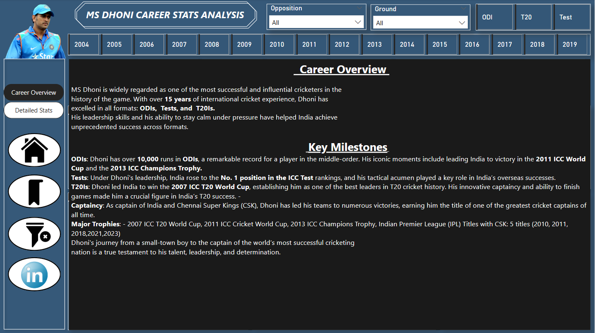

# 🏏 MS Dhoni Career Stats - Power BI Dashboard

This Power BI dashboard is a tribute to the legendary cricketer Mahendra Singh Dhoni. It provides an interactive visual summary of his career statistics across all formats — ODIs, Tests, and T20s.

## 📊 Dashboard Highlights

- **Career Overview**: Key milestones, captaincy record, and overall career summary.
- **Format-Wise Stats**: Total runs, batting average, strike rate, dismissals, and balls faced.
- **Performance Trends**:
  - Runs per year
  - Best innings by opposition team, ground, and batting position
- **Interactive Filters**:
  - Year selector (2004–2019)
  - Match format (ODI, Test, T20)
  - Team and venue filters
- **Bookmark Navigation**: Smooth switching between report sections.

## 🛠 Tools Used

- Microsoft Power BI
- Power Query for data transformation
- DAX for calculated measures
- Slicer bookmarks for interactivity

## 📷 Dashboard Snapshots

| Career Overview | Detailed Stats |
|-----------------|----------------|
|  |  |

> 🔖 Custom bookmark button:  
> 

---

## 📥 How to Use

1. Clone or download this repository.
2. Open the `.pbix` file in Power BI Desktop.
3. Explore the visuals and interact with filters to gain insights.

---

## 📁 Files Included

- `MS_Dhoni.pbix` – Power BI report file
- `Career overview.png` – Report snapshot
- `Detailed Stats.png` – Report snapshot
- `Bookmark.png` – Bookmark design

---

## 🙌 About Me

I’m a passionate Data Analyst who loves combining sports and data.  
This dashboard is part of my Power BI portfolio — check out more on my [LinkedIn](https://www.linkedin.com/in/your-profile).

---

Made with ❤️ using Power BI.
